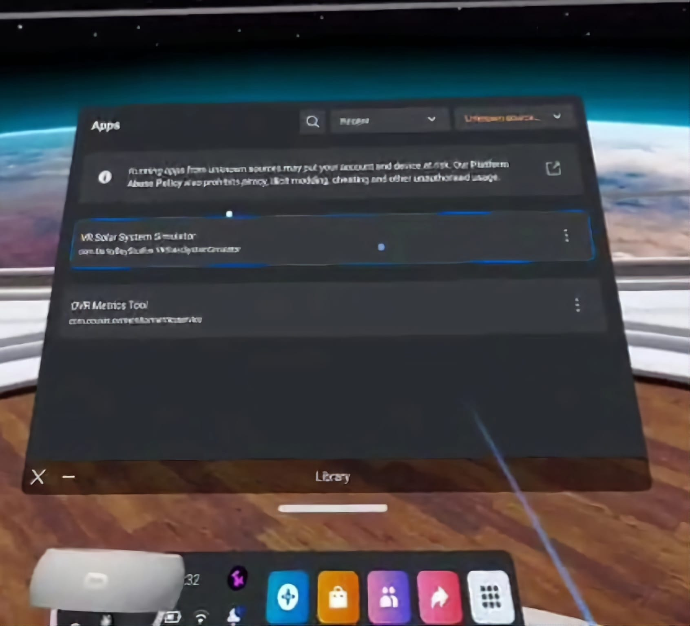

# VRSS Simulator in Unity
***
## Table of Contents
- [VRSS Simulator in Unity](#vrss-simulator-in-unity)
  - [Table of Contents](#table-of-contents)
  - [Preface](#preface)
  - [Contributors](#contributors)
  - [Project Overview](#project-overview)
  - [How To Build/Load The VRSS Simulator](#how-to-buildload-the-vrss-simulator)
  - [How To Use the VRSS Simulator](#how-to-use-the-vrss-simulator)
      - [UI Interaction](#ui-interaction)
      - [User Movement And Interaction](#user-movement-and-interaction)
  
## Preface
> Note: This README is still being changed

This repository contains the reworked Virtual Reality Solar System (VRSS) Simulator from our [Final Year Project](https://github.com/CASE-R/VR-SolarSystem-UNITY) produced during a summer placement.

In the event this simulator is further developed, this repo can be shared/forked/handed over to future developers so long as all [Contributors](##Contributors) are publicly shown below as best as possible to be shared on portfolios.

## Contributors
| [@CASE-R](https://github.com/CASE-R) | [@Bruhmao](https://github.com/Bruhmao) |  [TBC]()  |  [TBC]()  |
|--------------------------------------|----------------------------------------|---|---|
|                                      |                                        |   |   |

***
## Project Overview
This VRSS Simulator is to act as an educational tool to teach Newtonian Physics in an interactive manner using the Unity Engine and it's VR-support capabilities. This involves realtime customised physics such as Newtonian Gravity, whilst also grabbing, throwing and editing orbiting bodies creating a Zero-G Sandbox environment.

> Note: Expect this README to change overtime with development

## How To Build/Load The VRSS Simulator
This version of the simulator was built specifically to be used by an Oculus Quest 2. Currently as of 13/07/2022 you have to directly build the Unity application via the Unity Editor onto the Quest 2 by loading the project and connecting the Quest 2 to your PC via the link cable. This will require developer mode, this is shown in this [Grendel Games Blog](https://grendelgames.com/setting-up-your-oculus-within-unity-to-develop-vr-applications/), giving a full walkthrough of what should be done.
> A detailed guide will be added in the future showing how this is done.

Alternatively, if you are using an older Oculus device it may be possible to use a similar method above but building the simulator for "Windows, Mac, Linux" to be run off your PC and then used through a connected headset (this was done in the [previous version of the project](https://github.com/CASE-R/VR-SolarSystem-UNITY) for an Oculus Rift device).
> A detailed guide will be added in the future showing how this is done.

    
<b>Loading The VRSS Simulator In Oculus Quest 2</b>

    

    To load up the simulator within the Quest 2 during testing, you have to first make sure your Quest device is in developer mode and set up appropriately as hinted at above.
    Doing this will allow your `.apk` file to be launched from the App Library from the Quest Home Screen.
    <blockquote> Be sure to look at "Unkown Sources" to launch the simulator as shown below. </blockquote>
    

    

        
    

    
<b>Loading The VRSS Simulator On Desktop</b>

    

    Assuming you have built the simulator as a desktop app from the Unity Engine, once your Quest 2 is connected with the Oculus App open <b>and Unknown Sources are enabled</b> via <code>Settings > General > Unkown Sources</code> the executable file from the <code>Build(s)</code> folder can be run simply as that.
    Startup of the simulator should instantly recognise active VR input from your headset.
    

## How To Use the VRSS Simulator
Once loaded into the simulator, you should find yourself in front of the main menu screen allowing you to choose which scene to load or to exit it.

    

#### UI Interaction
Interacting with any UI feature requires you to aim with either controller and pressing `Button.One` once the ray interactor changes colour.
>For example, using the right controller this would be the `A` Button

Some UI panels will be unpinnable from world space, just like much of the standard Quest UI except it must be gripped using the `PrimaryHandTrigger` on the side of a controller when the ray interactor is targeting and turns green.

#### User Movement And Interaction
User Movement is mostly controlled using both thumbsticks and index triggers to control motion and orientation.
User Interaction is mostly controlled by pressing buttons during a ray interaction. This applies to both UI interaction and scene interaction where a user may grab a Celestial object.

|Controller|Input|Output|
|:--:|:--:|:--:|
|Right|`Axis2D.PrimaryThumbstick`|Rotate Player|
|Right|`Button.PrimaryThumbstick`|Ascend|
|Right|`Axis1D.PrimaryIndexTrigger`|Throttle|
|Right|`Button.One`|Interact w/ UI OR Move Object Inwards   |
|Right|`Button.Two`|Move Object Outwards|
|Right|`Axis1D.PrimaryHandTrigger`|Grab Object|
|Right|   |   |
|Left|`Axis2D.PrimaryThumbstick`|Move Player In Direction of User's Face|
|Left|`Button.PrimaryThumbstick`|Descend|
|Left|`Axis1D.PrimaryIndexTrigger`|Brake|
|Left|`Button.One`|Interact w/ UI|
|Left|`Button.Two`| |
|Left|`Axis1D.PrimaryHandTrigger`|Grab Object|
|Left|   |   |

